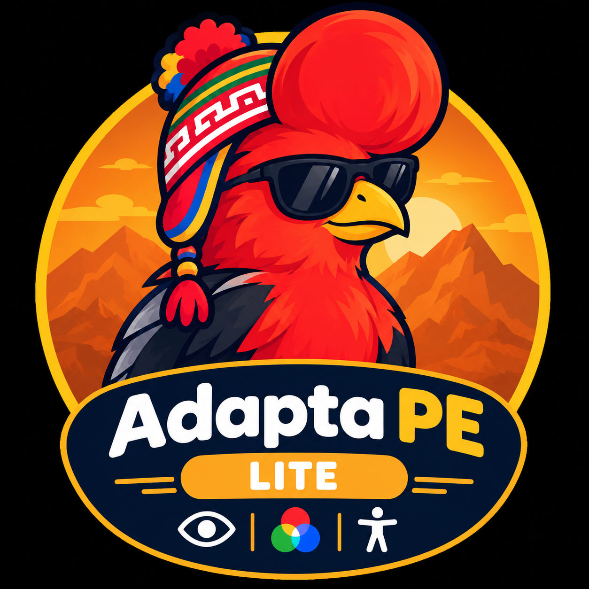

<p align="center">
  
</p>

# 🇵🇪 Adapta PE Lite — Asistencia de Voz y Filtros de Daltonismo Avanzados

> **Versión:** 1.0 (Manifest V3)  
> **Compatibilidad:** Google Chrome, Brave, Microsoft Edge y navegadores basados en Chromium.  

---

## 📋 Tabla de Contenidos
1. [¿Qué es Adapta PE Lite?](#-qué-es-adapta-pe-lite)
2. [Características Principales](#-características-principales)
3. [Guía de Instalación y Uso en Google Chrome](#-guía-de-instalación-y-uso-en-google-chrome)
4. [Arquitectura del Sistema](#-arquitectura-del-sistema)
5. [Explicación Detallada del Código (Archivo por Archivo)](#-explicación-detallada-del-código-archivo-por-archivo)
6. [Catálogo de Comandos de Voz](#-catálogo-de-comandos-de-voz)
7. [Filtros de Daltonismo (Matrices SVG)](#-filtros-de-daltonismo-matrices-svg)
8. [Seguridad y Privacidad](#-seguridad-y-privacidad)
9. [Licencia y Créditos](#-licencia-y-créditos)

---

## 🌟 ¿Qué es Adapta PE Lite?

**Adapta PE Lite** es una versión ligera y optimizada de Adapta PE. Esta extensión de navegador web está enfocada en proveer **Asistencia de Voz** y **Filtros de Daltonismo Avanzados**, permitiendo democratizar el acceso a la web a personas con discapacidades visuales o de movilidad reducida. Transforma cualquier página web convencional en un entorno más accesible de forma rápida y sin consumir demasiados recursos.

---

## 🚀 Características Principales

* 🤖 **Asistente de Voz Inteligente:** Reconocimiento de voz continuo en español (`es-PE`). Se activa diciendo **"Computadora"** para escuchar comandos de navegación (abrir/cerrar pestañas, scroll, búsqueda, y dictado).
* 👁️ **Filtros de Daltonismo en Tiempo Real:** Algoritmo basado en filtros SVG (`feColorMatrix`) que ajusta la paleta de colores para *Protanopia*, *Deuteranopia* y *Tritanopia*.
* ⚡ **Ultra Ligero:** Al remover funcionalidades pesadas de visión artificial como el Mouse Cinético y el lector TalkBack, garantiza un rendimiento superior y menor consumo de CPU/RAM, ideal para equipos de bajos recursos.

---

## 🛠️ Guía de Instalación y Uso en Google Chrome

### Paso 1: Descargar o clonar el proyecto
Asegúrate de tener la carpeta del proyecto en tu equipo local.

### Paso 2: Cargar la extensión en Google Chrome
1. Abre Google Chrome y escribe en la barra de direcciones:
   ```text
   chrome://extensions/
   ```
2. En la esquina superior derecha, activa la casilla o interruptor **"Modo de desarrollador"** (*Developer mode*).
3. Aparecerán nuevos botones en la parte superior izquierda. Haz clic en **"Cargar descomprimida"** (*Load unpacked*).
4. En el explorador de archivos, selecciona la carpeta `extensiónLite` que contiene el archivo `manifest.json`.
5. ¡Listo! Verás la tarjeta de **Adapta PE Lite** instalada y habilitada.
6. Haz clic en el ícono de la pieza de rompecabezas en la barra de herramientas de Chrome y fija (*Pin*) el ícono de **Adapta PE Lite** para tenerlo siempre a mano.

### Paso 3: Permisos de Navegador (Micrófono)
Cuando actives por primera vez el **Asistente de Voz**, el navegador te solicitará permisos de micrófono:
- Haz clic en **"Permitir"**.
- En caso de haber denegado el permiso por error, haz clic en el ícono de candado/ajustes a la izquierda de la barra de direcciones URL del sitio web actual y restablece los permisos a "Permitir".

---

## 🏗️ Arquitectura del Sistema

El siguiente diagrama ilustra cómo interactúan los diferentes componentes de la extensión:

```text
+-------------------------------------------------------------------------+
|                              USUARIO                                    |
+-------------------+--------------------+--------------------------------+
                    |                    |
         Ajustes en Popup UI         Voz / Micrófono
                    |                    |
                    v                    |
          +-------------------+          |
          |    popup.html     |          |
          |    popup.js       |          |
          +---------+---------+          |
                    |                    |
       chrome.storage.local.set()        |
                    |                    |
                    v                    v
          +---------------------------------------------------------------+
          |                      content_script.js                        |
          |  (Inyectado en la pestaña activa / Manipula el DOM directamente)|
          |                                                               |
          |  1. Motor de Voz (SpeechRecognition es-PE)                    |
          |  2. Filtros Daltonismo (SVG feColorMatrix dinámico)           |
          +-------------------------------+-------------------------------+
                                          |
                      chrome.runtime.sendMessage()
                                          |
                                          v
          +---------------------------------------------------------------+
          |                        background.js                          |
          |                   (Service Worker Central)                    |
          |                                                               |
          |  - chrome.tabs.create() / chrome.tabs.remove()                |
          |  - chrome.tabs.update() (Búsquedas Inteligentes)              |
          |  - chrome.tts.speak() (Lectura del asistente)                 |
          +---------------------------------------------------------------+
```

---

## 🔍 Explicación Detallada del Código (Archivo por Archivo)

### 1. `manifest.json`
Es el archivo de configuración y registro principal exigido por las extensiones de Google Chrome bajo el estándar **Manifest V3**.
Configura el nombre de la extensión ("Adapta PE Lite"), versión ("1.0"), los permisos requeridos (`storage`, `tabs`, `system.display`), los scripts de fondo (`background.js`) y los content scripts (que incluyen `VoiceAssistant.js` y `FiltrosDaltonismo.js`).

### 2. `popup.html`
Es la ventana emergente que se muestra al presionar el ícono de la extensión.
Contiene los interruptores (switches) y menús para:
- Activar o desactivar el Asistente de Voz.
- Seleccionar el tipo de Filtro de Daltonismo (Normal, Protanopia, Deuteranopia, Tritanopia).

### 3. `popup.js`
Es el script controlador que gestiona los eventos de la interfaz gráfica del popup.
Guarda los estados en `chrome.storage.local` y envía mensajes de actualización en tiempo real (`actualizar_estado`) a las pestañas abiertas para aplicar los cambios sin recargar la página.

### 4. `background.js`
Es el **Service Worker** central del navegador. Corre en segundo plano y maneja operaciones privilegiadas:
- Búsqueda Inteligente: Procesa comandos de voz que piden búsquedas (ej. "buscar X en YouTube") abriendo la plataforma correcta (Google, Amazon, ChatGPT, etc.).
- Gestión de pestañas: Abrir o cerrar pestañas a petición del Asistente de Voz.
- Manejo de ventanas: Puede abrir resultados en el monitor secundario si está disponible.

### 5. `content_script.js`
Inyectado en todas las páginas web, instancia los módulos principales de la versión Lite:
- **`VoiceAssistant`**: Motor que gestiona el reconocimiento de voz.
- **`FiltrosDaltonismo`**: Modifica la renderización visual aplicando las matrices de color a nivel del `document.documentElement`.
Escucha los cambios del popup para activar o desactivar estas funcionalidades al instante.

---

## 🎙️ Catálogo de Comandos de Voz

Cuando el **Asistente de Voz** está activo, primero debes decir la palabra clave **"Computadora"**, esperar el pitido, y luego pronunciar con naturalidad cualquiera de las siguientes instrucciones:

| Comando Verbal | Acción Ejecutada |
| :--- | :--- |
| `"nueva pestaña"` o `"abrir pestaña"` | Abre una nueva pestaña. |
| `"cerrar pestaña"` | Cierra la pestaña activa en ese momento. |
| `"bajar"` o `"hacia abajo"` | Hace scroll suave hacia abajo. |
| `"subir"` o `"hacia arriba"` | Hace scroll suave hacia arriba. |
| `"buscar [término]"` o `"busca [término] en [sitio]"` | Busca en la plataforma deseada (Google, YouTube, MercadoLibre, etc.). |
| `"escribir [texto]"` | Escribe el texto dictado en el campo de texto activo. |
| `"abre [sitio]"` o `"entra a [sitio]"` | Navega rápidamente a sitios conocidos (YouTube, Wikipedia, Amazon, ChatGPT, etc.). |

---

## 🎨 Filtros de Daltonismo (Matrices SVG)

Adapta PE Lite utiliza **matrices de transformación de color matemáticas** estandarizadas para recalcular los canales Rojo (R), Verde (G) y Azul (B), ajustando los colores dinámicamente mediante SVG `<feColorMatrix>`:

* **Protanopia (Deficiencia de Rojo):**
  * `R' = (0.567 * R) + (0.433 * G) + (0.000 * B)`
  * `G' = (0.558 * R) + (0.442 * G) + (0.000 * B)`
  * `B' = (0.000 * R) + (0.242 * G) + (0.758 * B)`

* **Deuteranopia (Deficiencia de Verde):**
  * `R' = (0.625 * R) + (0.375 * G) + (0.000 * B)`
  * `G' = (0.700 * R) + (0.300 * G) + (0.000 * B)`
  * `B' = (0.000 * R) + (0.300 * G) + (0.700 * B)`

* **Tritanopia (Deficiencia de Azul):**
  * `R' = (0.950 * R) + (0.050 * G) + (0.000 * B)`
  * `G' = (0.000 * R) + (0.433 * G) + (0.567 * B)`
  * `B' = (0.000 * R) + (0.475 * G) + (0.525 * B)`

---

## 🔒 Seguridad y Privacidad

* **Procesamiento de Voz Local:** Dependiendo de las APIs del navegador, el procesamiento de voz trata de minimizar el envío de datos priorizando herramientas nativas.
* **Sin Recolección de Datos:** Adapta PE Lite no recolecta historial de navegación, contraseñas ni cookies.
* **Almacenamiento Local Aislado:** Todas las opciones y configuraciones se almacenan exclusivamente dentro del almacenamiento local del navegador del usuario (`chrome.storage.local`).

---

### 📄 Licencia y Créditos

<a href="https://example.com">Adapta PE Lite</a> © 2026 by <a href="https://thealejo-dev.cc">Rodrigo Alejandro Apcho Aliaga</a> is licensed under <a href="https://creativecommons.org/licenses/by-nc-sa/4.0/">Creative Commons Attribution-NonCommercial-ShareAlike 4.0 International</a>

Desarrollado con dedicación para promover la inclusión digital y la accesibilidad universal en el Perú y el mundo.

> 🤖 **Declaración de uso de Inteligencia Artificial:** En este proyecto se utilizaron herramientas de Inteligencia Artificial generativa para la creación y optimización de recursos gráficos/imágenes, así como para la asistencia y co-creación en partes específicas del código fuente (sin abarcar la totalidad del desarrollo, el cual fue diseñado, integrado y supervisado por el autor).

