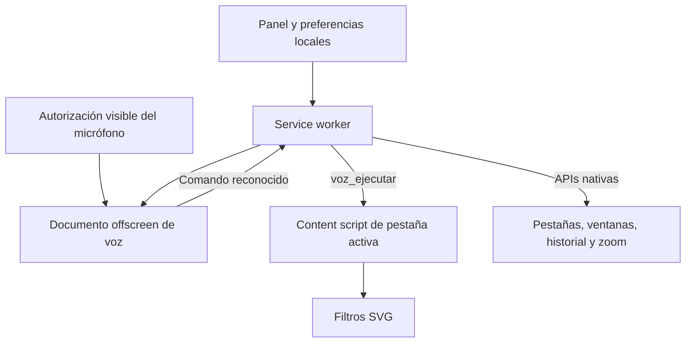

<p align="center">
  
</p>

# 🇵🇪 Adapta PE Lite — Asistencia de voz y filtros de color

> **Versión del código:** 2.0 · Manifest V3.
> **Requisito mínimo del manifest:** Chromium 116 o posterior.
> **Navegadores objetivo:** Google Chrome y derivados Chromium, como Edge y Brave; la voz requiere una API de reconocimiento disponible.
> **Sitio oficial:** [adaptape.thealejo-dev.cc](https://adaptape.thealejo-dev.cc).
> **Código fuente:** [TheAlejo160/Adapta-PE-Lite](https://github.com/TheAlejo160/Adapta-PE-Lite).

## Contenido

- [Qué es Adapta PE Lite](#qué-es-adapta-pe-lite)
- [A quién está dirigida](#a-quién-está-dirigida)
- [Cómo funciona en el uso diario](#cómo-funciona-en-el-uso-diario)
- [Descarga e instalación](#descarga-e-instalación)
- [Primer uso](#primer-uso)
- [Usos y ejemplos](#usos-y-ejemplos)
- [Comandos de voz](#comandos-de-voz)
- [Filtros de color](#filtros-de-color)
- [Arquitectura y código](#arquitectura-y-código)
- [Backend Python opcional](#backend-python-opcional-estado-real)
- [Privacidad y alcance](#privacidad-y-alcance)
- [Actualizaciones y solución de problemas](#actualizaciones-y-solución-de-problemas)
- [Desarrollo y comprobaciones](#desarrollo-y-comprobaciones)
- [Autoría, licencia y uso de IA](#autoría-licencia-y-uso-de-ia)

## Qué es Adapta PE Lite

**Adapta PE Lite** es una extensión centrada en **asistencia de voz y filtros de color**. Conserva íntegros esos módulos: permite abrir sitios, buscar, gestionar pestañas y ventanas, dictar en campos, resaltar elementos y activarlos por su nombre.

| Función de Lite | Uso |
| --- | --- |
| Voz global | Dar órdenes al navegar entre webs, pestañas y ventanas. |
| Búsquedas y aperturas | Acceder a sitios del catálogo o a un dominio explícito. |
| Dictado y formularios | Enfocar campos e introducir o enviar texto. |
| Selección y clic por voz | Identificar un elemento, resaltarlo y confirmar su activación. |
| Siete filtros de color | Cambiar la presentación visual y conservarla entre webs permitidas. |

Lite se instala de manera independiente. Si también utilizas [Adapta PE Base](https://github.com/TheAlejo160/Adapta-PE), **activa Voz sólo en una variante** para evitar dos reconocedores simultáneos. Sus preferencias y permisos son independientes.

## A quién está dirigida

- Personas que quieren adaptar la presentación de colores a su percepción o comodidad visual.
- Personas que prefieren navegar, buscar o dictar por voz y reducir el uso repetido del teclado y ratón.
- Estudiantes, profesionales y público general que buscan esas funciones en una extensión centrada en voz y filtros.

La voz debe poder ser reconocida por el navegador y los elementos deben tener nombres o etiquetas que la extensión pueda localizar. Los filtros son transformaciones visuales fijas, no una corrección personalizada ni un diagnóstico.

## Cómo funciona en el uso diario

Activa Voz, concede el permiso de micrófono de la extensión y utiliza «Computadora» seguida de una orden. La escucha permanece al cambiar de pestaña o ventana; cada frase se dirige a una sola página de destino. En Nueva pestaña puedes abrir sitios, buscar y gestionar las pestañas y ventanas mediante las operaciones nativas disponibles.

Elige el filtro de color en el panel. La preferencia se aplica a las webs permitidas, incluidas las ya abiertas y las pestañas de fondo. La extensión recupera sus controladores sin pedirte que recargues cada web. Si Chrome protege una página, los filtros y las acciones sobre elementos de esa página no pueden aplicarse allí.

## Descarga e instalación

### Desde el repositorio: ZIP o Git

**Descarga ZIP:** abre [el repositorio de Adapta PE Lite](https://github.com/TheAlejo160/Adapta-PE-Lite), selecciona **Code → Download ZIP** y extrae el archivo en una carpeta permanente.

**Con Git:**

```bash
git clone https://github.com/TheAlejo160/Adapta-PE-Lite.git
```

No necesitas compilar, ejecutar `npm install` ni iniciar Python. Selecciona siempre **la carpeta que contiene directamente `manifest.json`**, no el ZIP ni una carpeta superior: normalmente `Adapta-PE-Lite` al clonar o `Adapta-PE-Lite-main` al extraer. En un entorno con ambas variantes puede llamarse `extensiónLite`.

1. Abre `chrome://extensions/` en Chrome.
2. Activa **Modo de desarrollador**.
3. Pulsa **Cargar descomprimida** y selecciona esa carpeta.
4. Comprueba que aparezca **Adapta PE Lite** habilitada y fija su icono en la barra de herramientas.
5. Las webs ya abiertas reciben los scripts automáticamente, sin recargarlas.

En Edge o Brave utiliza su página de extensiones equivalente. El soporte de reconocimiento de voz puede variar entre navegadores. No elimines ni muevas la carpeta mientras la instalación descomprimida la utilice.

## Primer uso

1. Fija el icono de la extensión desde el menú de extensiones de Chrome y abre su panel.
2. Activa **Voz**. Si falta autorización, se abrirá una página de la extensión: pulsa **Permitir micrófono** y acepta el permiso del navegador. También puedes abrirla con **Configurar micrófono** en el panel.
3. Di **«Computadora, abre YouTube»**. También puedes decir sólo **«Computadora»**, esperar el pitido y dar el comando dentro de los siguientes **8 segundos**.
4. Repite «Computadora» para cada nueva orden. Prueba «Computadora, busca accesibilidad en Wikipedia» o «Computadora, siguiente pestaña».
5. Para dictar, abre una web con un formulario, di «Computadora, enfoca correo» y después «Computadora, escribe Hola Perú». El campo debe ser visible y editable; su etiqueta o nombre debe coincidir con el que pronuncias.
6. Elige un filtro en el panel si lo necesitas. **Visión Normal (Sin Filtros)** restablece la presentación sin el filtro de Adapta PE.

La escucha continúa al navegar, cambiar de pestaña o ventana y usar Nueva pestaña. En las webs, un indicador muestra el estado; en páginas protegidas puedes consultarlo desde el panel. **Desactivar Voz libera el micrófono y cierra el documento central de escucha de Lite.** El permiso pertenece a la extensión, no a cada sitio; una instalación diferente puede requerir su propia autorización.

La configuración inicial requiere abrir el panel y aceptar los permisos del navegador. Los comandos permiten después controlar las acciones admitidas del navegador y de la página.

## Usos y ejemplos

| Necesidad | Cómo utilizar la extensión |
| --- | --- |
| Investigar o estudiar | «Computadora, abre Wikipedia» y «Computadora, busca accesibilidad en Wikipedia». |
| Navegar entre tareas | «Computadora, abre Gmail en una nueva pestaña» y «Computadora, siguiente pestaña». |
| Completar un formulario | «Computadora, enfoca correo», «Computadora, escribe mi dirección» y, al terminar, «Computadora, enviar formulario». |
| Elegir un elemento de una tienda | «Computadora, selecciona zapatos azules», revisar el resaltado y después «Computadora, dale clic». |
| Ajustar la presentación de una web | Elegir un filtro de color en el panel o retirarlo con **Visión Normal**. |

Las frases son ejemplos: cambia el nombre del campo, producto o enlace por el que realmente aparezca en la web. Una orden como «enviar formulario» o «clic en Confirmar» ejecuta la acción del sitio; revisa su contenido antes de dar la orden.

### Seleccionar antes de hacer clic

1. Di «Computadora, selecciona» seguido del nombre visible o accesible del elemento. También acepta «seleccionar» y «resalta».
2. La extensión lo acerca a la vista, coloca un contorno amarillo y anuncia la selección. **Seleccionar no hace clic.**
3. Di «Computadora, dale clic», «Computadora, hazle clic» o «Computadora, activa lo seleccionado» para activarlo una vez.
4. Para retirarlo, di «Computadora, cancelar selección» o «Computadora, quita la selección».

La selección pertenece a esa página. Cambiar de pestaña no traslada el objetivo a otra web. Si el elemento desaparece, se deshabilita o queda oculto, la confirmación no activa un control diferente: vuelve a seleccionarlo. La búsqueda por nombre depende del texto, etiquetas y estructura accesible de cada sitio; no identifica productos a partir de una descripción libre de su imagen.

## Comandos de voz

Los ejemplos de esta sección se pronuncian después de **«Computadora»** o dentro de su ventana de escucha. El reconocimiento está configurado en español de Perú (`es-PE`).

| Orden y variantes | Resultado |
| --- | --- |
| `abre YouTube`, `ejecuta Netflix`, `visita GitHub` | Abre la portada de un sitio del catálogo. |
| `abre example.com`, `abre https://example.com` | Abre un dominio o URL HTTP/HTTPS explícita. |
| `busca Perú en YouTube`, `busca en Wikipedia accesibilidad` | Busca en la plataforma indicada; admite `consulta`, `encuentra`, `investiga` y `haz una búsqueda de…`. |
| `busca accesibilidad` | Usa la plataforma actual si tiene búsqueda en el catálogo; si no, intenta un formulario de búsqueda visible y finalmente Google. |
| `abre YouTube en una nueva pestaña`, `busca Perú en otra ventana` | El modificador al final elige el destino. Sin modificador, la apertura o búsqueda usa la pestaña actual. |
| `nueva pestaña`, `abre una nueva ventana` | Crea la página Nueva pestaña nativa del navegador. |
| `cierra esta pestaña`, `cerrar ventana` | Cierra la pestaña o toda la ventana de destino. |
| `atrás`, `volver`, `regresa`; `adelante`, `avanza` | Navega por el historial de la pestaña. |
| `recarga`, `actualiza la página`, `refrescar página` | Recarga la pestaña. |
| `siguiente pestaña`, `pestaña anterior` | Recorre las pestañas de la misma ventana, volviendo al extremo opuesto al llegar al final. |
| `baja`, `abajo`, `sube`, `arriba` | Desplaza el 70 % de la altura de pantalla. `Sube un poco` usa 25 %; `baja más`, 95 %. |
| `ve al inicio`, `ir al final` | Va al principio o al final de la página. |
| `aumenta zoom`, `acerca`; `reduce zoom`, `aleja`; `zoom normal` | Cambia el zoom en pasos de 10 puntos porcentuales, entre 25 % y 500 %, o lo devuelve al 100 %. |
| `enfoca correo`, `enfoca nombre` | Enfoca un campo visible por etiqueta, nombre accesible o placeholder. |
| `escribe Hola Perú`, `dicta…`, `introduce…` | Inserta texto en el cursor o selección del campo enfocado. Admite campos editables y `contenteditable`. |
| `borra el texto`, `limpia el campo` | Vacía el campo editable enfocado. |
| `presiona enter`, `pulsa enter`, `enviar formulario` | Solicita el envío del formulario del campo enfocado, respetando su validación. |
| `clic en Contacto`, `haz clic en Guardar`, `pulsa…` | Activa un enlace o control visible por su nombre accesible. `Abrir [nombre]` también puede activar botones o enlaces. |
| `selecciona zapatos azules`, `seleccionar…`, `resalta…` | Resalta un elemento visible por su nombre, lo acerca a la vista y anuncia la selección; todavía no hace clic. |
| `dale clic`, `hazle clic`, `activa lo seleccionado` | Activa la selección una sola vez. Si desapareció o quedó oculta, debes seleccionarla de nuevo. |
| `clic`, `haz clic` | Activa la selección si existe; si no, intenta activar el elemento enfocado. |
| `reproduce el video`, `continuar video`, `pausa el audio` | Reproduce o pausa el primer video/audio encontrado. La web puede exigir una interacción para reproducir. |
| `cancela`, `cancelar`, `olvídalo` | Cancela el comando pendiente y retira la selección. |

El dictado conserva el texto reconocido, incluidos acentos, mayúsculas y signos. Las palabras de navegación dentro del dictado o una búsqueda no se tratan como órdenes independientes. La puntuación y precisión finales dependen del reconocimiento del navegador.

### Sitios y búsquedas

El catálogo compartido de `sitios.js` incluye Google, YouTube, Mercado Libre, Amazon, Wikipedia, Facebook, Instagram, X/Twitter, Reddit, Netflix, Twitch, GitHub, ChatGPT, Claude, Gemini, Canvas, Gmail, Outlook/Hotmail, WhatsApp, Telegram, Google Drive, Google Docs, Google Maps, LinkedIn, TikTok, Spotify, Bing y DuckDuckGo. Acepta alias como «You Tube», «Git Hub», «Chat GPT», «equis», «wasap» y «mapas».

Las aperturas usan portadas explícitas. Las búsquedas usan las rutas del catálogo; cuando una plataforma no tiene ruta configurada, se abre una búsqueda de Google con `site:dominio`. Esto **no consulta correo, documentos ni contenido privado** de esas plataformas. Canvas usa una portada genérica; para una institución concreta, abre su dominio. Un nombre desconocido en «abre…» se busca entre los controles de la página y no se convierte automáticamente en una búsqueda de Google.

Cuando una apertura o búsqueda pide otra ventana, el worker intenta situarla en un monitor secundario disponible. «Nueva ventana» sin URL crea la ventana nativa, sin esa selección de pantalla.

### Límites de navegación

Chrome impide ejecutar content scripts en páginas protegidas, como `chrome://` y Chrome Web Store. Allí la voz central permite las operaciones nativas admitidas, como aperturas, búsquedas, pestañas, ventanas, historial y zoom, según las restricciones del navegador. **No escribe en la barra de direcciones ni pulsa botones de la interfaz de Chrome.** Dictado, clic, desplazamiento y filtros necesitan una página web donde pueda ejecutarse el content script.

La compatibilidad con formularios, reproductores, editores complejos, iframes y controles depende de cómo esté construida cada web. Los eventos sintéticos no siempre equivalen a una interacción física aceptada por el sitio.

## Filtros de color

El panel ofrece siete filtros y una opción sin filtro:

| Opción | Transformación disponible |
| --- | --- |
| Protanomalía y Protanopia | Matrices para variaciones en los canales asociados al rojo/verde. |
| Deuteranomalía y Deuteranopia | Matrices para variaciones en los canales asociados al verde/rojo. |
| Tritanomalía y Tritanopia | Matrices para variaciones en los canales asociados al azul/amarillo. |
| Acromatopsia | Escala de grises. |
| Visión Normal | Retira el filtro de Adapta PE. |

`FiltrosDaltonismo` inserta un SVG con `feColorMatrix` y aplica una referencia CSS al documento y a los selectores de pantalla completa. Por ejemplo, la matriz de Protanopia calcula `R′ = 0.567R + 0.433G`, `G′ = 0.558R + 0.442G` y `B′ = 0.242G + 0.758B`.

Son transformaciones visuales fijas: no diagnostican ni corrigen médicamente el daltonismo, y su utilidad puede variar entre personas y sitios. Elige la opción que te resulte más cómoda; los nombres no implican una corrección personalizada.

## Arquitectura y código

La extensión utiliza **HTML, CSS y JavaScript nativo**, sin React, Vue ni jQuery. Manifest V3 separa las preferencias, las operaciones privilegiadas y las acciones sobre páginas.



### Responsabilidad de los archivos

| Archivo | Función |
| --- | --- |
| `manifest.json` | Versión, permisos, service worker y orden de inyección. Exige Chromium 116 o posterior. |
| `popup.html` / `popup.js` | Panel, lectura y escritura de preferencias en `chrome.storage.local`; avisos `actualizar_estado` a las pestañas. |
| `voz/popup.js` | Estado global de escucha en el panel y botón para configurar micrófono. |
| `sitios.js` | Catálogo único de portadas, rutas de búsqueda y alias; `normalizarVoz()` y `reconocerSitio()`. También se carga en el worker con `importScripts`. |
| `background.js` | `sincronizarPaginas()` reconecta y asigna prioridad; `sincronizarVoz()` serializa creación/cierre offscreen; `gestionarVoz()` fija la pestaña activa por frase; `ejecutarAccion()` y `gestionarAperturaURL()` usan las APIs del navegador. |
| `voz/escucha.html` / `voz/escucha.js` | Único reconocedor activo por extensión. Comunica comandos y estado mediante runtime; consulta las preferencias y pestañas a través del worker. |
| `voz/permisos.html` / `voz/permisos.js` | Autorización visible: solicita audio, detiene el flujo de prueba y pide reiniciar la escucha. |
| `clases/VoiceAssistant.js` | Clase reutilizable: reconocimiento en offscreen y parser de comandos DOM en la página. |
| `clases/FiltrosDaltonismo.js` | Inserta, aplica y retira filtros SVG/CSS. |
| `content_script.js` | Instancia los módulos de esta variante, aplica preferencias y recibe órdenes e indicadores. Añade `data-adapta-extension="true"` para detección por la web oficial. |
| `app.py` | Prototipo Flask opcional y separado; no interviene en las funciones actuales de la extensión. |

### Recorrido de una orden de voz

1. El panel guarda `voz`; el worker sincroniza un documento offscreen mediante una promesa serializada para evitar escuchas duplicadas o reactivaciones tras apagar.
2. `voz/escucha.js` inicia `VoiceAssistant` cuando el micrófono tiene permiso. Los content scripts usan su parser, **sin iniciar reconocimiento ni micrófono**.
3. El reconocedor agrupa resultados finales durante **550 ms** y provisionales estables durante **1.200 ms**. Consume prefijos por índice para no repetir la orden cuando llega el resultado final; una transcripción idéntica no reinicia la espera.
4. Tras «Computadora», el texto se envía al worker. Éste comprueba el origen central y toma una sola vez la pestaña activa de la última ventana enfocada.
5. En una web, envía `voz_ejecutar` a su content script. Si falta el controlador, lo conecta sin recargar la web; si Chrome protege la página, usa el parser central para las operaciones permitidas del navegador.
6. La clase reinicia el reconocimiento al terminar, con esperas entre **300 ms y 5 s** según los fallos. Un permiso denegado requiere corregirlo y reactivar Voz.

El worker conecta automáticamente los controladores al instalar, actualizar, cambiar de pestaña o ventana y modificar preferencias. `chrome.scripting` permite recuperar webs ya abiertas sin recargarlas; la inyección es idempotente y usa el documento concreto para evitar ejecutar en una navegación posterior. La selección por voz pertenece a cada página. Los filtros se aplican también en pestañas de fondo; la voz prioriza la pestaña de la ventana enfocada.

El worker responde de forma asíncrona y captura fallos. Las aperturas de URL admiten sólo HTTP/HTTPS. Los avisos a pestañas sin receptor manejan silenciosamente la desconexión para no saturar la consola.

### Mensajes, selección y reconexión

`VoiceAssistant` interpreta patrones y sinónimos definidos en JavaScript: no consulta un modelo generativo para decidir qué acción ejecutar. `normalizarVoz()` normaliza las intenciones y los nombres; el dictado utiliza la transcripción original para conservar acentos y mayúsculas. `sitios.js` separa la portada de cada plataforma de su ruta de búsqueda.

| Mensaje | Recorrido y responsabilidad |
| --- | --- |
| `voz_comando` | El documento central entrega la frase al service worker, que captura una sola pestaña de destino. |
| `voz_ejecutar` | El worker entrega la frase al parser DOM de ese documento. |
| `voz_fallback` | En páginas protegidas, el parser central resuelve únicamente las operaciones nativas admitidas. |
| `pagina_lista` / `control_prioridad` | El controlador se registra y el worker determina qué página recibe la prioridad. |
| `voz_resultado` / `voz_indicador` | Comunican el resultado y actualizan el indicador de la página prioritaria. |
| `hablar` / `callar` | El worker utiliza `chrome.tts` para emitir o detener las confirmaciones habladas. |
| `actualizar_estado` / `chrome.storage.onChanged` | Propagan las preferencias a controladores existentes. |

La selección vive en `VoiceAssistant.elementoSeleccionado`, sin guardarse en almacenamiento. `encontrarElemento()` busca coincidencias completas antes de parciales; `seleccionarElemento()` añade un atributo y CSS propios; `pulsarSeleccion()` comprueba la disponibilidad del objetivo, lo activa y limpia la selección. Los nombres pueden proceder de `aria-label`, etiquetas, texto visible, `alt`, placeholder o título.

`asegurarControlador()` comprueba `adaptaPEControlador.vigente()` y utiliza `chrome.scripting.executeScript()` si falta el controlador. Las clases y el catálogo se exportan desde IIFE para admitir reinyección. El destino se fija mediante `documentId`, y un evento DOM propio permite retirar recursos del contexto anterior al actualizar. `sincronizarPaginas()` serializa los cambios y descarta transiciones antiguas; los avisos a páginas sin receptor capturan las desconexiones.

### Preferencias y permisos

Lite guarda `voz` y `daltonismo`. Su controlador instancia `VoiceAssistant` como parser DOM y `FiltrosDaltonismo`. El permiso `tts` anuncia el elemento seleccionado; no transforma la extensión en un lector de pantalla.

| Permiso del manifest | Uso |
| --- | --- |
| `storage` | Preferencias locales de la extensión. |
| `tabs` | Consultar la pestaña de destino y gestionar navegación/pestañas. |
| `scripting` | Conectar o recuperar los módulos en webs ya abiertas sin recargar la página. |
| `system.display` | Consultar pantallas al abrir una URL en otra ventana. |
| `offscreen` | Mantener la escucha en un documento de extensión independiente de la página. |
| `tts` | Confirmar verbalmente la selección solicitada por voz. |
| `<all_urls>` | Inyectar funciones de accesibilidad en los sitios permitidos por Chrome; no evita sus restricciones de páginas protegidas. |

El permiso de micrófono se concede mediante las APIs de medios y sus avisos correspondientes; no lo reemplaza el acceso a sitios del manifest.

## Backend Python opcional: estado real

`app.py` existe como **prototipo de desarrollo** del «Ojo Biónico». No hay conexión actual desde el panel o el content script ni un modelo real de análisis. **No necesitas Python para usar la extensión**, la voz o los filtros.

Si deseas probar el prototipo, desde la carpeta que contiene `app.py`, con Python 3.8 o posterior:

```bash
python -m venv .venv
# macOS / Linux
source .venv/bin/activate
# Windows: .venv\Scripts\activate
python -m pip install flask flask-cors
python app.py
```

| Ruta | Entrada y salida actuales |
| --- | --- |
| `GET /estado` | JSON con el mensaje de disponibilidad del servidor. |
| `POST /analizar_imagen` | Recibe JSON con `src`, registra ese valor, espera un segundo y devuelve siempre la misma descripción simulada. |

Comprueba el estado en `http://127.0.0.1:5000/estado`. El script arranca en modo de depuración y con CORS general; es un prototipo local, sin restricciones de origen específicas ni configuración de producción.

## Privacidad y alcance

- La extensión guarda preferencias en `chrome.storage.local`. No implementa almacenamiento de grabaciones o transcripciones; el texto del indicador de voz vive en memoria.
- El reconocimiento depende de `SpeechRecognition` / `webkitSpeechRecognition` del navegador y **puede enviar audio a un servicio en línea**. No se garantiza voz sin conexión ni procesamiento de audio exclusivamente local.
- Los comandos leen los elementos necesarios de la página para encontrar campos, enlaces y botones. Las búsquedas envían la consulta al sitio o buscador elegido como una navegación normal.
- El código de la extensión no implementa recopilación de cookies, contraseñas ni un registro de historial. El comando «atrás/adelante» utiliza el historial de la pestaña mediante las APIs del navegador.
- El prototipo Python no recibe datos desde la interfaz actual de Lite.

El funcionamiento depende del reconocimiento disponible, los permisos y la estructura de cada web. Adapta PE facilita acciones de accesibilidad; no garantiza acceso completo a cualquier sitio ni reemplaza todas las funciones de un lector de pantalla del sistema.

## Actualizaciones y solución de problemas

Para una instalación desde el repositorio, descarga los cambios o ejecuta `git pull` dentro de la carpeta clonada. Después **recarga la extensión una vez en `chrome://extensions/`**. El worker reconecta automáticamente las webs abiertas; no tienes que recargar cada página. La instalación de la tienda puede llevar una versión distinta de la del repositorio; este README describe el código de esta carpeta.

| Problema | Comprobación |
| --- | --- |
| No escucha o indica micrófono no disponible | Abre **Configurar micrófono**, revisa el permiso de la extensión y del sistema operativo, y desactiva/activa Voz después de corregirlo. |
| El navegador no admite reconocimiento | Comprueba la disponibilidad de su API de voz. Ser Chromium no garantiza reconocimiento; prueba en Google Chrome con los permisos concedidos. |
| Repite órdenes o compite por el micrófono | Comprueba que Voz esté activa en una sola variante de Adapta PE. |
| «Reconectando micrófono» persiste | Revisa conexión, disponibilidad del servicio de reconocimiento y dispositivo de audio; el motor reintenta automáticamente los fallos recuperables. |
| Dictado, clic o filtros no funcionan en Nueva pestaña | Son acciones de página; prueba en una web permitida. Usa «abre…» o «busca…» para salir de Nueva pestaña. |
| El dictado no se inserta | Enfoca un campo visible y editable; comprueba su nombre con «enfoca…». |
| No responde tras actualizar | Recarga la extensión; reconecta las webs permitidas automáticamente. Comprueba el acceso al sitio concedido en Chrome. |
| Service worker aparece «Inactiva» | Es normal en Manifest V3: despierta cuando recibe eventos. |

Los avisos de publicidad de YouTube, `ERR_BLOCKED_BY_CLIENT`, `ublock-filters.js` o `ryd.content-script.js` pueden proceder del sitio o de otras extensiones. Para reportar un fallo de Adapta PE, indica variante, versión del manifest, navegador, comando, estado del indicador, nombre del archivo y excepción; evita incluir datos privados.

## Desarrollo y comprobaciones

Mantén JavaScript nativo, nombres y mensajes en español, IDs propios con prefijo `adapta-pe-` y manejo de desconexiones en mensajes a pestañas. Revisa las funciones por nombre; los números de línea cambian al editar.

Mantén sincronizados con Base el catálogo `sitios.js`, `VoiceAssistant.js`, `FiltrosDaltonismo.js`, los archivos comunes de escucha/permisos/popup de voz y las funciones compartidas de `background.js`. Base utiliza `classes/` y Lite `clases/`; conserva la instancia de voz y filtros propia de Lite al actualizar manifest y controlador. No copies módulos ajenos a su alcance.

Las pruebas compartidas del entorno de desarrollo buscan Lite como carpeta hermana llamada `extensiónLite`. **La carpeta `tests/` está excluida del control de versiones mediante `.gitignore`: los comandos de prueba sólo funcionan si dispones de esos archivos locales.** Clonar las dos extensiones por sí solo no descarga las pruebas. Para preparar la estructura de carpetas:

```bash
git clone https://github.com/TheAlejo160/Adapta-PE.git extensión
git clone https://github.com/TheAlejo160/Adapta-PE-Lite.git extensiónLite
cd extensión
```

Si cuentas con los archivos de pruebas locales, ejecuta `node tests/motores.test.cjs` desde Base. Utiliza Node y módulos nativos para verificar el catálogo, sinónimos, dictado, reconocimiento y sincronización de los módulos compartidos. Lite no contiene una carpeta de pruebas propia.

Para las pruebas locales de integración MV3 y acciones DOM:

```bash
node tests/browser.test.cjs
```

Necesitan un Node con `fetch` y `WebSocket` globales y Chrome compatible con CDP `Extensions.loadUnpacked`. Utilizan un perfil temporal y comandos inyectados, silencian el audio y registran las confirmaciones TTS en memoria. Puedes indicar el ejecutable de Chrome con `ADAPTA_CHROME`. Estos comandos no acreditan la precisión del reconocimiento con voces reales ni sustituyen la evaluación con personas usuarias.

Al revisar Lite, verifica autorización visible, búsquedas desde Nueva pestaña, continuidad entre ventanas, dictado en un formulario, selección sin clic, confirmación de la selección, desactivación de Voz y persistencia de los filtros. Ninguna prueba de desarrollo es necesaria para instalar o usar la extensión.

## Autoría, licencia y uso de IA

<a href="https://adaptape.thealejo-dev.cc">Adapta PE Lite</a> © 2026 by <a href="https://thealejo-dev.cc">Rodrigo Alejandro Apcho Aliaga</a> is licensed under <a href="https://creativecommons.org/licenses/by-nc-sa/4.0/">Creative Commons Attribution-NonCommercial-ShareAlike 4.0 International</a>

Desarrollado con dedicación para promover la inclusión digital y la accesibilidad universal en el Perú y el mundo.

### Derechos de autor y condiciones de reutilización

**© 2026 Rodrigo Alejandro Apcho Aliaga — TheAlejo160.** Autor y responsable del diseño, integración y supervisión de este proyecto.

Se conserva la licencia del proyecto **Creative Commons Atribución-NoComercial-CompartirIgual 4.0 Internacional (CC BY-NC-SA 4.0)**. Permite compartir y adaptar el material sujeto a sus condiciones:

- Reconocer la autoría, enlazar la licencia e identificar las modificaciones.
- Mantener la reutilización bajo fines no comerciales.
- Distribuir las adaptaciones con la misma licencia o una compatible admitida por ella.
- Evitar condiciones o medidas tecnológicas que limiten los usos que la licencia permite.

Consulta el [resumen oficial en español](https://creativecommons.org/licenses/by-nc-sa/4.0/deed.es) y el [texto legal](https://creativecommons.org/licenses/by-nc-sa/4.0/legalcode.es). Los avisos del repositorio se mantienen en [LICENSE](LICENSE) y [LICENSE.txt](LICENSE.txt).

### Declaración de uso de IA

> 🤖 **Declaración de uso de Inteligencia Artificial:** En este proyecto se utilizaron herramientas de Inteligencia Artificial generativa para la creación y optimización de recursos gráficos/imágenes, así como para la asistencia y co-creación en partes específicas del código fuente (sin abarcar la totalidad del desarrollo, el cual fue diseñado, integrado y supervisado por el autor).

